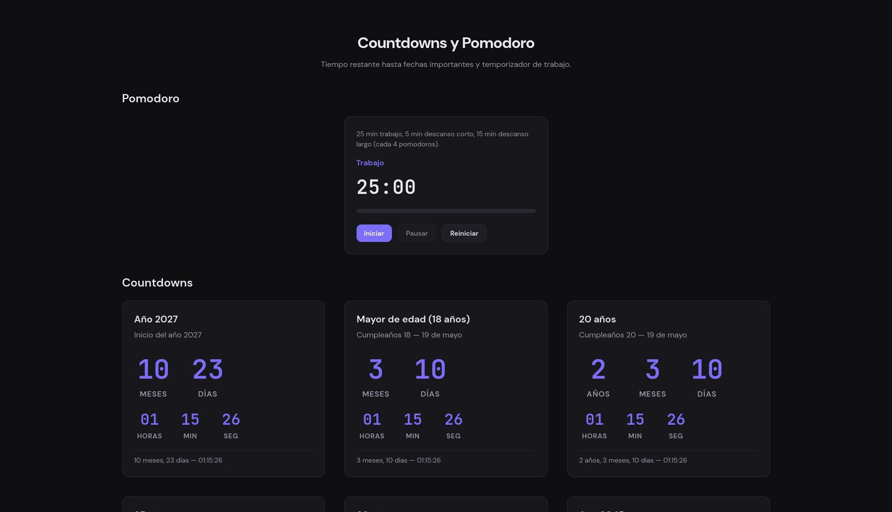

# WEB-Time

**Personal site with countdowns to important dates, Pomodoro timer, custom timers, and world clock.**

[](https://fravelz.github.io/WEB-Time/)

🔗 **Live at:** [https://fravelz.github.io/WEB-Time/](https://fravelz.github.io/WEB-Time/)

Built with **Next.js 15** (App Router), **React 18**, **TypeScript**, and **Tailwind CSS v4**.

---

## What’s included

- **Home** — Hero image, countdown accordion (2027, age 18, 20/25/30, 2045). Target dates at midnight Colombia time.
- **Pomodoro** — 25 min work, 5 min short break, 15 min long break (every 4 pomodoros). Start, pause, reset.
- **Timer** — Multiple timers with editable hours and minutes. Add, start, pause, reset, or remove each one.
- **World clock** — Live clocks for Colombia, USA, Russia, China, Japan, UK, Europe, and Brazil.

Responsive layout, dark theme, and custom 404 page.

---

## Quick start

**Requirements:** Node.js 18+

**pnpm** is recommended:

```bash
git clone <repo>
cd WEB-Time
pnpm install
pnpm run dev
```

Open [http://localhost:3000](http://localhost:3000). The `/` route redirects to `/inicio`.

**Routes:**

| Route            | Content           |
|------------------|-------------------|
| `/`              | Redirects to Home |
| `/inicio`        | Countdowns + image |
| `/pomodoro`      | Pomodoro timer    |
| `/temporizador`  | Multiple timers   |
| `/hora`          | World clock       |

---

## Project structure

```
├── src/
│   ├── app/
│   │   ├── layout.tsx         # Global layout (header + footer)
│   │   ├── page.tsx           # Redirect to /inicio
│   │   ├── not-found.tsx      # 404 page
│   │   ├── globals.css        # Tailwind + theme variables
│   │   ├── inicio/page.tsx    # Home page
│   │   ├── pomodoro/page.tsx  # Pomodoro page
│   │   ├── temporizador/page.tsx
│   │   └── hora/page.tsx
│   ├── components/
│   │   ├── SiteHeader.tsx     # Nav (links to routes)
│   │   ├── InicioSection.tsx  # Image + countdowns
│   │   ├── CountdownGrid.tsx  # Countdown accordion
│   │   ├── CountdownCard.tsx
│   │   ├── Pomodoro.tsx
│   │   ├── TemporizadorSection.tsx
│   │   └── HoraSection.tsx
│   ├── config/
│   │   └── countdowns.ts      # Target dates & birth date
│   └── lib/
│       ├── countdown.ts       # Time-remaining logic
│       └── formatting.ts      # Pluralization & formatting
├── public/
│   ├── screenshot.png
│   └── Copia-de-Napoleón-Brienne.jpg
├── postcss.config.mjs         # PostCSS for Tailwind v4
└── package.json
```

---

## Time zone (Colombia)

Target dates are set to **midnight in Colombia (America/Bogotá, UTC-5)** in `src/config/countdowns.ts` (function `midnightColombia`). “Now” uses the browser’s local time.

---

## Configuration

In **`src/config/countdowns.ts`**:

- **Birth date:** `BIRTH_YEAR`, `BIRTH_MONTH`, `BIRTH_DAY` (default May 19, 2008). Used to compute countdowns for ages 18, 20, 25, and 30.
- **Fixed countdowns:** year 2027, year 2045. You can add or remove entries.
- **Timezone:** `COLOMBIA_UTC_OFFSET_HOURS` (5) in case Colombia’s offset changes.

---

## Scripts

| Command          | Description        |
|------------------|--------------------|
| `pnpm run dev`   | Development server  |
| `pnpm run build` | Production build   |
| `pnpm start`     | Serve build        |
| `pnpm run lint`  | Lint               |

---

## Production

```bash
pnpm run build
pnpm start
```

---

> **Author:** Fravelz
