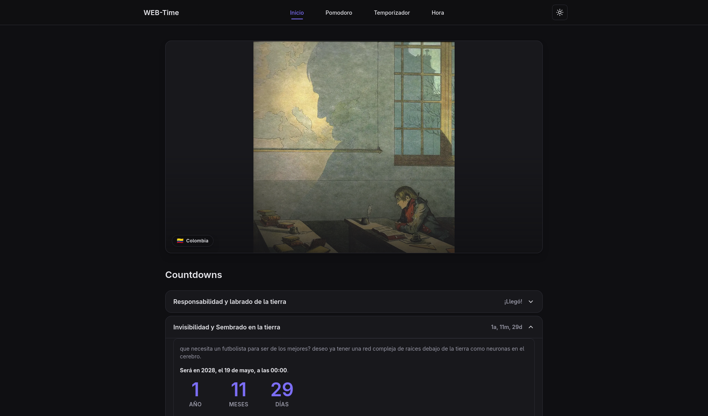

# WEB-Time

[Spanish version](./README.md)

**Countdowns to important dates, Pomodoro timer, custom timers with stopwatch, and world clock.**



Built with **Next.js 15** (App Router), **React 18**, **TypeScript**, **Tailwind CSS v4**, and **pnpm**.

---

## What’s included

- **Home** (`/inicio`) — Hero image and countdown accordion. Target dates are at midnight, Colombia time; configuration lives in `src/features/inicio/config/countdowns.ts` (ages from birth date plus the 2045 milestone).
- **Pomodoro** (`/pomodoro`) — 25 min work, 5 min short break, 15 min long break (every 4 pomodoros). Start, pause, and reset. State keeps running when you navigate away.
- **Timer** (`/temporizador`) — Multiple timers with editable hours and minutes, plus **stopwatch** mode. Add, start, pause, reset, or remove each timer. Timers and stopwatch keep running in the background while you browse the site.
- **World clock** (`/hora`) — Live clocks for Colombia, USA, Russia, China, Japan, UK, France, Germany, and India.

**Cross-cutting:**

- **Light and dark** theme (`ThemeToggle` in the header, `web-time-theme` cookie, `public/theme-init.js` to avoid flash on load).
- Header badges when Pomodoro or timer/stopwatch is running (`SiteHeader`).
- Responsive layout, visible keyboard focus on nav and countdown accordion.
- Custom 404 page (`src/app/not-found.tsx`).
- Keyboard navigation (Tab / Shift+Tab).

---

## Quick start

**Requirements:** Node.js 18+

**pnpm** is recommended:

```bash
git clone <repo>
cd WEB-Time
pnpm install
pnpm run dev
```

Open [http://localhost:3000](http://localhost:3000). The `/` route redirects to `/inicio`.

**Routes:**

| Route           | Content                       |
| --------------- | ----------------------------- |
| `/`             | Redirects to Home             |
| `/inicio`       | Countdowns + image            |
| `/pomodoro`     | Pomodoro timer                |
| `/temporizador` | Multiple timers and stopwatch |
| `/hora`         | World clock by time zone      |

---

## Project structure

```text
├── src/
│   ├── app/                    # App Router routes (thin wrappers)
│   │   ├── layout.tsx          # Global layout, metadata, SSR theme
│   │   ├── globals.css         # Tailwind v4 + theme variables
│   │   ├── page.tsx            # Redirect to /inicio
│   │   ├── not-found.tsx
│   │   └── {inicio,pomodoro,temporizador,hora}/page.tsx
│   ├── features/               # Per-section logic
│   │   ├── inicio/             # Countdowns, config, accordion
│   │   ├── pomodoro/           # Context and 25/5/15 phases
│   │   ├── temporizador/       # Context, reducer, hooks, TimerCard
│   │   └── hora/               # Clocks by IANA zone
│   ├── components/
│   │   ├── layout/             # SiteHeader, SiteFooter, FeaturePageShell
│   │   └── ui/                 # ThemeToggle, icons, controls
│   ├── providers/              # AppProviders, ThemeProvider
│   ├── lib/                    # theme, theme.server, fonts, time, cn
│   └── types/                  # e.g. css.d.ts
├── public/
│   ├── theme-init.js           # Theme before hydration (no flash)
│   ├── alarma.mp3
│   ├── screenshot.png
│   └── Copia-de-Napoleón-Brienne.jpg
├── postcss.config.mjs
├── next.config.ts
└── package.json
```

---

## Scripts

| Command                 | Description                       |
| ----------------------- | --------------------------------- |
| `pnpm run dev`          | Development server                |
| `pnpm run build`        | Production build                  |
| `pnpm start`            | Serve build (after `build`)       |
| `pnpm run lint`         | ESLint                            |
| `pnpm run lint:fix`     | ESLint with auto-fix              |
| `pnpm run format`       | Prettier (format)                 |
| `pnpm run format:check` | Prettier (check only)             |
| `pnpm run react:doctor` | React diagnostics (optional, dev) |

---

> **Author:** Fravelz
>
> **License:** Apache 2.0
