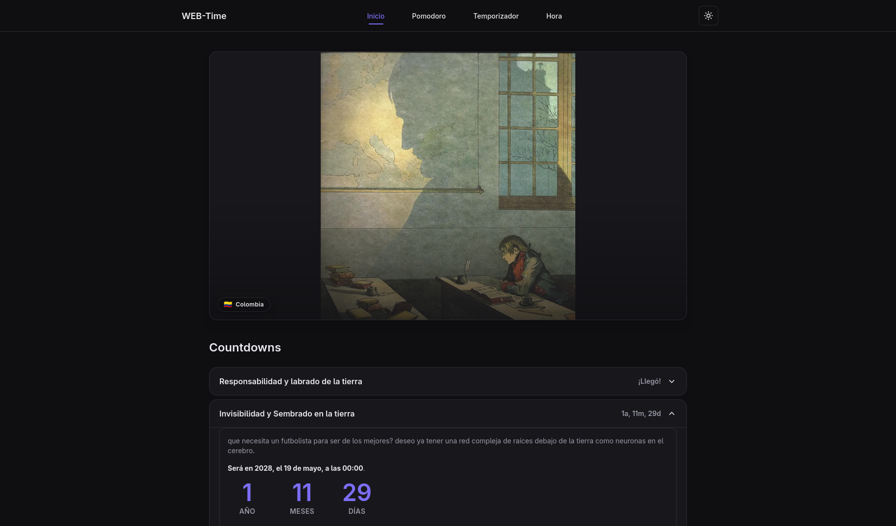

# WEB-Time

[English version](./README.EN.md)

**Web personal desplegada en [GitHub Pages](https://fravelz.github.io/WEB-Time/): countdowns hacia fechas importantes, temporizador Pomodoro, temporizadores personalizados con cronómetro y hora mundial.**

[](https://fravelz.github.io/WEB-Time/)

Hecho con **Next.js 15** (App Router), **React 18**, **TypeScript**, **Tailwind CSS v4** y **pnpm**.

---

## Qué incluye

- **Inicio** (`/inicio`) — Imagen destacada y countdowns en acordeón. Las fechas objetivo son a medianoche en Colombia; la configuración está en `src/features/inicio/config/countdowns.ts` (edades desde la fecha de nacimiento y meta 2045).
- **Pomodoro** (`/pomodoro`) — 25 min trabajo, 5 min descanso corto, 15 min descanso largo (cada 4 pomodoros). Iniciar, pausar y reiniciar. El estado sigue activo al cambiar de página.
- **Temporizador** (`/temporizador`) — Varios temporizadores con horas y minutos editables, más modo **cronómetro**. Añadir, iniciar, pausar, reiniciar o quitar cada uno. Los temporizadores y el cronómetro siguen en segundo plano al navegar por la web.
- **Hora** (`/hora`) — Relojes en tiempo real para Colombia, EE. UU., Rusia, China, Japón, Reino Unido, Francia, Alemania e India.

**Transversal:**

- Tema **claro y oscuro** (`ThemeToggle` en el header, cookie `web-time-theme`, script `public/theme-init.js` para evitar flash al cargar).
- Header con indicadores si hay Pomodoro o temporizador/cronómetro en marcha (`SiteHeader`).
- Diseño responsive, foco visible en navegación y acordeón de countdowns.
- Página 404 personalizada (`src/components/pages/not-found/`).

---

## Inicio rápido

**Requisitos:** Node.js 18+

Se recomienda **pnpm**:

```bash
git clone <repo>
cd WEB-Time
pnpm install
pnpm run dev
```

Abre [http://localhost:3000](http://localhost:3000). La ruta `/` redirige a `/inicio`.

**Rutas:**

| Ruta            | Contenido                                      |
| --------------- | ---------------------------------------------- |
| `/`             | Redirige a Inicio                              |
| `/inicio`       | Countdowns + imagen                            |
| `/pomodoro`     | Reloj Pomodoro                                 |
| `/temporizador` | Temporizadores múltiples y cronómetro           |
| `/hora`         | Hora mundial por zona                          |

---

## Estructura del proyecto

```
├── src/
│   ├── app/                    # Rutas App Router (wrappers finos)
│   │   ├── layout.tsx          # Layout global, metadata, tema SSR
│   │   ├── globals.css         # Tailwind v4 + variables de tema
│   │   ├── page.tsx            # Redirección a /inicio
│   │   ├── not-found.tsx
│   │   └── {inicio,pomodoro,temporizador,hora}/page.tsx
│   ├── features/               # Lógica por sección
│   │   ├── inicio/             # Countdowns, config, acordeón
│   │   ├── pomodoro/           # Contexto y fases 25/5/15
│   │   ├── temporizador/       # Context, reducer, hooks, TimerCard
│   │   └── hora/               # Relojes por zona IANA
│   ├── components/
│   │   ├── layout/             # SiteHeader, SiteFooter, FeaturePageShell
│   │   ├── ui/                 # ThemeToggle, iconos, controles
│   │   └── pages/not-found/
│   ├── providers/              # AppProviders, ThemeProvider
│   ├── lib/                    # theme, theme.server, fonts, time, cn
│   └── types/                  # p. ej. css.d.ts
├── public/
│   ├── theme-init.js           # Tema antes de hidratar (sin flash)
│   ├── alarma.mp3
│   ├── screenshot.png
│   └── Copia-de-Napoleón-Brienne.jpg
├── postcss.config.mjs
├── next.config.ts
└── package.json
```

---

## Zona horaria (Colombia)

Las fechas objetivo se definen a **medianoche en Colombia (America/Bogotá, UTC-5)** en `src/features/inicio/config/countdowns.ts` (función `midnightColombia`). El cálculo del tiempo restante usa la hora del navegador (`src/features/inicio/lib/countdown.ts`).

---

## Configuración

En **`src/features/inicio/config/countdowns.ts`**:

- **Fecha de nacimiento:** `BIRTH_YEAR`, `BIRTH_MONTH`, `BIRTH_DAY` (por defecto 19 de mayo de 2008). Con ellos se generan countdowns a los 18, 20, 25, 30, 35, 40, 45, 50, 55 y 60 años.
- **Countdown fijo:** año 2045 (`midnightColombia(2045, 1, 1)`). Puedes añadir, editar o quitar entradas en `buildCountdowns()`.
- **Zona:** `COLOMBIA_UTC_OFFSET_HOURS` (5) por si Colombia cambiara de UTC-5.

---

## Tema claro/oscuro

- Preferencia guardada en la cookie **`web-time-theme`** (`light` | `dark`), no en `localStorage`.
- **`public/theme-init.js`** se carga antes de la hidratación para aplicar el tema sin parpadeo; si no hay cookie, usa `prefers-color-scheme`.
- El servidor lee la cookie en `src/lib/theme.server.ts` y pone `data-theme` en el `<html>`; el toggle está en el header (`ThemeToggle` + `ThemeProvider`).

---

## Scripts

| Comando                 | Descripción                          |
| ----------------------- | ------------------------------------ |
| `pnpm run dev`          | Servidor de desarrollo               |
| `pnpm run build`        | Build de producción                  |
| `pnpm start`            | Servir build (tras `build`)          |
| `pnpm run lint`         | ESLint                               |
| `pnpm run lint:fix`     | ESLint con corrección automática     |
| `pnpm run format`       | Prettier (formatear)                 |
| `pnpm run format:check` | Prettier (solo comprobar)            |
| `pnpm run clean`        | Borrar carpeta `.next`               |
| `pnpm run react:doctor` | Diagnóstico React (opcional, dev)    |

---

## Producción

```bash
pnpm run build
pnpm start
```

El sitio público está en **GitHub Pages**. En desarrollo o con `pnpm start`, Next.js puede leer la cookie de tema en el servidor para el HTML inicial. En hosting estático, `theme-init.js` y la cookie del navegador siguen aplicando el tema sin depender de Node en cada petición.

---

> **Autor:** Fravelz
